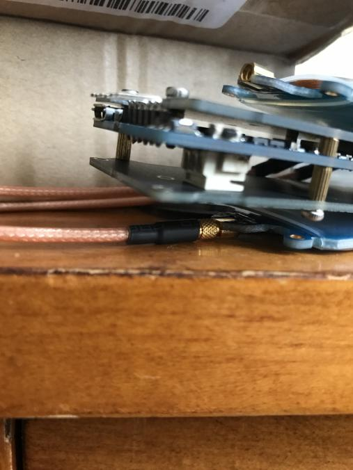
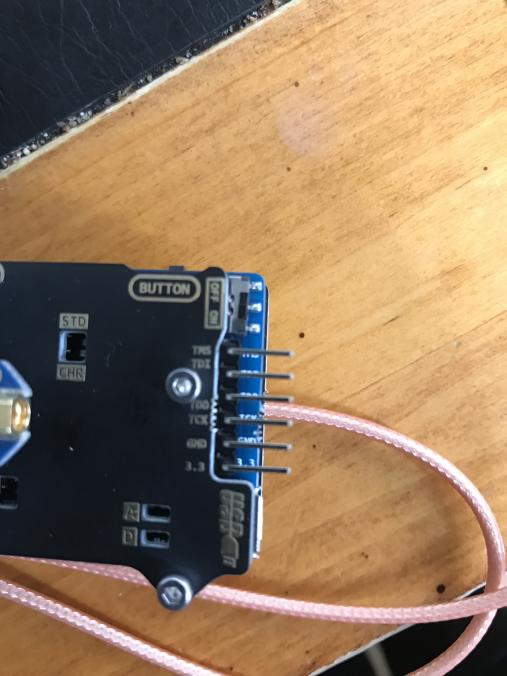
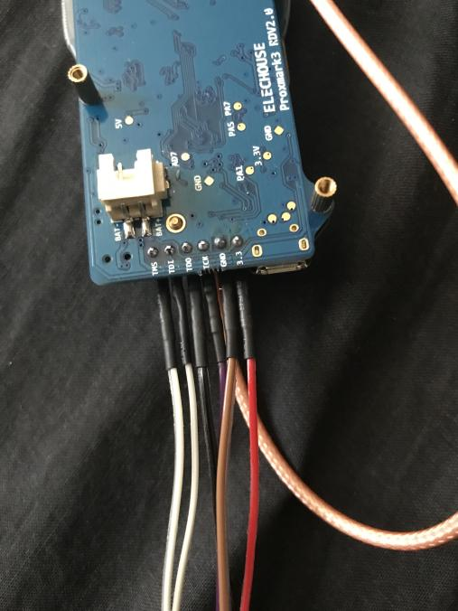

In this tutorial, we're going to go through the process of un-bricking a Proxmark3 using a Debian based Linux distro. I did this to an RDV2 that had bricked on me, but the steps can easily be modifed to work with a Pm3 Easy.

I put this together because the other guides for doing this are great, but skipped over a few steps and hoops that you'll need to jump through to get everything working. The Bus Pirate needs to be flashed with a specific firmware capable of supporting the Open On-Chip Debugger (OpenOCD), and the pinout diagrams present in the guides aren't universal, so you'll need to identify what cable to plug into what pin. Not to worry, we'll go over that.

# What you'll need to get started

*   A bricked Proxmark3. If you don't have one that's bricked, go ahead and brick one by flashing the bootloader and unplugging halfway through (**NOTE: Don't actually do this**)
*   A Bus Pirate version 3, capable of using Firmware 6.0. An example of what you want is [this](https://www.sparkfun.com/products/12942). Pick up a [cable](https://www.sparkfun.com/products/9556) too.
*   A pin header to connect the Proxmark and Bus Pirate cable. I recommend you buy a breakable curved pin header, that way you can break it into 6-pin chunks, as that's how long the pin header must be.
*   A multimeter, to test continuity and identify what cable to plug into which pin on the Proxmark.
*   (OPTIONAL) A soldering kit, to solder the pin header onto the Proxmark. You don't actually **have** to solder it on, but it's going to make flashing the bootloader and full image a pain because you have to hold the pin header in place and keep it stable. It's _reallllllllllly_ tricky but technically doable.
*   A Linux distro, preferable Debian Based. I did this on Parrot OS.

# Preparation: Bus Pirate
## Phase 1: Bus Pirate Prep

Hook up that Bus Pirate to your computer. Run "sudo dmesg" to check what port it's on (Mine usually went to /dev/ttyUSB0). If your computer can see the Bus Pirate and assign it to a port, you're in good shape. 

Next, we're going to run a diagnostic script to identify what firmware version you're working on. 

Run ```wget https://raw.githubusercontent.com/DangerousPrototypes/Bus_Pirate/master/scripts/version.pl```, and then open it up in your favourite text editor.

Since we're in a Linux distro, navigate to the following chunk of code and replace it to look like below:

```
# Set up the serial port for Windows
#use Win32::SerialPort;
#my $port = Win32::SerialPort->new($mysport); #change to your com port
#setup serial port for Linux
use Device::SerialPort;
my $port = Device::SerialPort->new("/dev/ttyUSB0"); #change to your com port
```
In your case, you'd replace that port with whatever port your distro assigns to the Bus Pirate.

Run ```perl version.pl```. You should see something close to the following:

```
Getting version string.
Entering binmode: OK.
Exiting binmode: OK.
Version info:
Hardware: Bus Pirate v3b
Firmware: Firmware v5.10 (r559)  Bootloader v4.4
PIC chip: DEVID:0x0447 REVID:0x3046 (24FJ64GA002 B8)
Updates URL: http://dangerousprototypes.com
```

If you don't see the Version Info, something's not right and you need to check your version script as well as assigned port.

The firmware will need to be flashed with a special fork capable of supporting OpenOCD, which is how we'll be connecting the Bus Pirate to the Proxmark3. Download it from [here](http://dangerousprototypes.com/forum/download/file.php?id=9188).

You also need a Bus Pirate flashing utility. Grab that [here](https://storage.googleapis.com/google-code-archive-downloads/v2/code.google.com/the-bus-pirate/BusPirate.firmware.v5.10.zip), extract it, and copy the hex file you downloaded in the previous link to the folder you just extracted.

## Phase 2: Flashing the Bus Pirate

You need to "prep" the bootloader to be flashed but putting into a mode, and the way to do this is to open up a serial connection to your Bus Pirate.

Run ```screen /dev/ttyUSB0 115200``` and change the port accordingly. That command opens a serial connection to the Bus Pirate using the documented Baud Rate. After a few seconds, a ```HiZ>``` prompt should show up. If it doesn't, press enter. Once you see the prompt, type "$". The Bus Pirate should respond with "BOOTLOADER". That means it's ready to be flashed. Go ahead and press Control+A and type ":quit". **DO NOT DISCONNECT THE BUS PIRATE**

In another terminal window, navigate to the directory you extracted your flash utility to, and run 

```
./pirate-loader_lnx --dev=/dev/ttyUSB0 --hello 
```

Replace your port accordingly as always. You should get a response similar to below:

```
Device ID: PIC24FJ64GA002 [d4]
Bootloader version: 1,02
```

You're now ready to flash the Bus Pirate. Run 
```
./pirate-loader_lnx --dev=/tty/USB0 --hex=busPirate.oocd.hex
```

And you'll see something like below (The size may be different, doesn't matter. What matters is that all was flashed OK.):

```
+++++++++++++++++++++++++++++++++++++++++++
+ Pirate-Loader for BP with Bootloader v4 +
+++++++++++++++++++++++++++++++++++++++++++
Parsing HEX file [busPirate.oocd.hex]
Found 21503 words (64509 bytes)
Fixing bootloader/userprogram jumps
Opening serial device COM10...OK
Configuring serial port settings...OK
Sending Hello to the Bootloader...OK
Device ID: PIC24FJ64GA002 [d4]
Bootloader version: 1,02
Erasing page 0, 0000...OK
Writing page 0 row 0, 0000...OK
Writing page 0 row 1, 0080...OK
...
Writing page 41 row 335, a780...OK
Firmware updated successfully!
Use screen /dev/ttyUSB0 115200 to verify
```

In the terminal window you ran screen in, run that screen command and verify you get a HiZ prompt. Once you see the prompt, type "i" and check the firmware. If it's 6.0, you're good to go!

# Preparation: Proxmark3 software/OpenOCD
Run the following commands to grab and build the offocial Proxmark3 Firmware and OpenOCD:

```
git clone https://github.com/Proxmark/proxmark3.git
cd proxmark3
make clean && make all
apt-get install openocd
```
That should be it on the Proxmark3 software side. You now need to figure out what cable to plug into where.

# Preparation: Proxmark3 hardware

Grab your 6-pin header and insert it into the Proxmark. Here's what that should look like:



You should now be all set to connect the Bus Pirate to the Proxmark and begin the unbricking process!

# Un-Bricking the Proxmark

Now that everything is set up and ready to go, you now need to figure out what coloured wire on the Sparkfun Cable to connect to what pin on the Proxmark3. 

## The manual method

This method will explain how to identify what pin on the Sparkfun Cable connects to what pin on the Bus Pirate. Make sure the black rectangular part of the cable is plugged into the Bus Pirate.

1. Take your multi-meter and touch one of the leads inside a wire on the cable. 
2. Touch the other lead on one of the pins OUTSIDE the black rectangle on the Bus Pirate, next to the description of each pin. 
3. If you hear a "beep" from your multi-meter, you have identified what pin corresponds to the coloured wire you're testing. If you don't hear a beep, apply the lead to a different pin on the Bus Pirate until you hear a beep. It is recommended that you make a note of what colour corresponds to what pin so you can connect your cable to the Proxmark properly.
4. Repeat until you have identified what colour corresponds to the following pins on the Bus Pirate: CS, MOSI, MISO, CLK, GND, and 3V3.

## The quick method

If you're using the Sparkfun Cable, the pinout diagram is below. Please note this may not be consistent with your cable:


| Bus Pirate Pin        | Proxmark3 Pin          | Colour |
|:-------------|:------------------|:------|
| CS           | TMS | White  |
| MOSI | TDI   | Grey  |
| MISO         | TDO      | Black  |
| CLK          | TCK | Purple  |
| GND          | GND | Brown
| 3V3          | 3V3 | Red

Here's what it should look like:



Now that you're all wired up, "cd" to the proxmark3 folder and run OpenOCD with the Bus Pirate attached to the PC and the Sparkfun Cable attached to the Proxmark:

```
openocd -f tools/at91sam7s512-buspirate.cfg
```
You should see the following message in the text that is returned from OpenOCD:

```
JTAG tap: sam7x.cpu tap/device found: 
```

If you **DON'T** see that message, or you see a message like "Error: sam7x.cpu: IR capture error; saw 0x00 not 0x01", then something is not connected properly. During this process, we needed to plug in the Proxmark3's power source as well, but this may not be the case for you and should only be tried as a last-case scenario in case it fries your pins since the Bus Pirate also provides power via the 3V3 pin.

In another terminal window, run the following commands:

```
telnet localhost 4444
halt
flash erase_sector 0 0 15
flash erase_sector 1 0 15
flash write_image ./armsrc/obj/fullimage.elf
flash write_image ./bootrom/obj/bootrom.elf
```

This will take some time as you are directly flashing a new bootrom and full image onto the Proxmark via a serial connection. If you didn't solder your pin header, you need to make sure you hold the pin header as still and stable as possible, as the flashing process can easily fail otherwise.

Once this is all done, go ahead and quit OpenOCD and Telnet, and disconnect the Bus Pirate and Proxmark.

Plug in the Proxmark into the PC and run "dmesg". If you see the Proxmark being assigned a port, congradulations! You now have a working Proxmark again.

# Troubleshooting


# Sources/Thank-Yous
https://twitter.com/nickinfosec?lang=en <--- Soldered the Pins onto the Proxmark and explained how to identify the Bus Pirate cables. Also is an all around cool guy.
https://scund00r.com/all/rfid/2018/05/18/debrick-proxmark.html <---- I used the commands to flash the Proxmark after everything was set up from this guide.
http://dangerousprototypes.com <---- General documentation for the Bus Pirate and how to add OpenOCD support.
